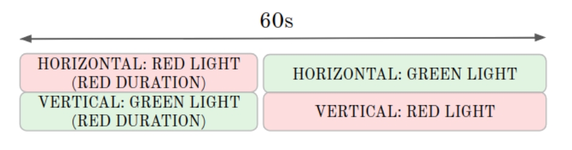
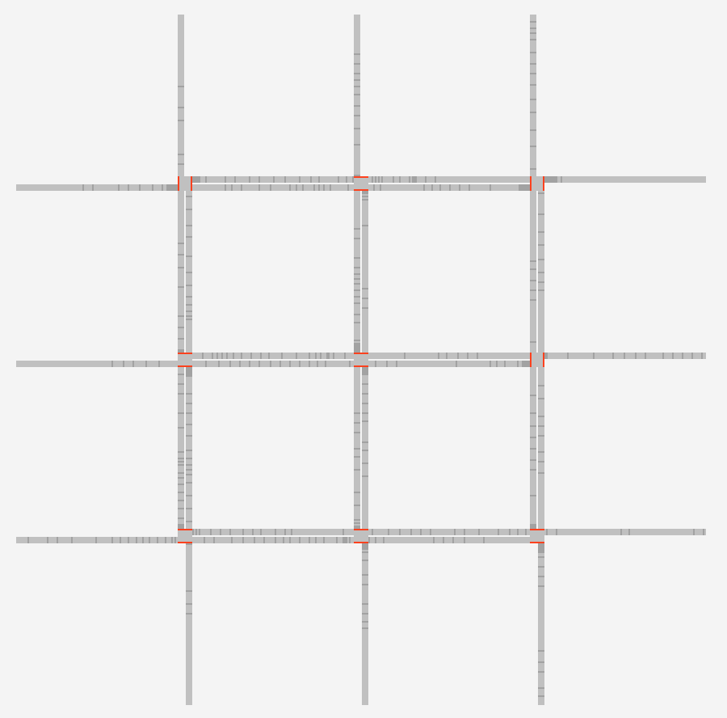

# gym-graph-traffic
Road traffic simulator for OpenAI Gym


## Installation

```
git clone git@github.com:rltraffic/gym-graph-traffic.git
cd gym-graph-traffic
pip install -e .
```

## Running an example

```
python3 examples/minimal.py 
```

## Configuration

All parameters considering configuration are available in `gym_graph_traffic/envs/params.py` file:

### Units glossary

According to default values:
- **Experiment** is a full run of a learning algorithm.

    1 experiment = *???* episodes (set manually by user in training loop) 
    
- **Episode** is a single complete simulation run from initial state to terminal state. The Agent’s goal it to maximize the total reward it receives during an episode. Different episodes are independent of one another.

    1 episode = 200 steps
    
- **Step** is a part of an episode executed under single action. (Number of steps = number of actions taken). 

    1 step = 60 seconds (of real traffic simulation)
    
    1 step = 22 updates (`STEP_LENGTH / SECONDS_PER_UPDATE`)

- **Update** is a single step of a [Nagel-Schreckenberg cellular automaton](https://en.wikipedia.org/wiki/Nagel%E2%80%93Schreckenberg_model) model.

    1 update = 2.7 seconds (of real traffic simulation)

### Action

Because a single action is a vector representing as an int. We introduced `action_int` – a single number encoding the `action_array`.
The `action_array` is a base *x* representation of `action_int`, where *x* is equal to the length of the `RED_DURATIONS` array.

Example of translation for *easy* preset:
```
                 0    1    2    3   # indices
RED_DURATIONS = [0,  20,  40,  60]
```

The length of the `RED_DURATIONS` array equals 4, so encoding has a base of 4 (quaternary) and 4 bits of encoding – *easy* road network has 4 intersections.
```
      4^3  4^2  4^1  4^0
20   [0,   1,   1,   0]
```
Above can be seen the quaternary representation of 20 (`4^2 + 4^1 = 20`).
There is a mapping between the bits in the quaternary representation and the `RED_DURATIONS` array indices.
Therefore, the translated `action_int = 20` equals `[0, 20, 20, 0]`. 
- First and forth intersections will have full, 60-second phase of horizontal flow.
- Second and third intersection will have 20 seconds of vertical, and then 40 seconds of horizontal flow.


Diagram representation of single step.

### Reward

Total distance covered by all cars in one step.

### Observation

Two vectors – average number of cars and average speed per road segment.

### Presets

The model is toroidal (periodic). 

By default there are 4 available presets:
- **easy** - one-lane, one-way road with 4 intersections.
- **two_roads** - two-way road with 4 intersections.
- **grid_4x2** - 4 by 2 grid of two-way roads (with a total of 8 intersections).
- **grid_3x3** - 3 by 3 grid of two-way roads (with a total of 9 intersections).


grid_3x3 preset.

Two create different sizes of presets there are two functions supplied in `util/grid.py`: `make_grid` and `make_line`.

### Rendering

The environment is not yet compatible with Gym-like rendering. Thus all rendering options have to be supplied within aforementioned `params.py` file.

### Reference table 

| parameter            |   default value | description |
|----------------------|----------------:|-------------|
| `STEPS_PER_EPISODE`  |             200 | Number of steps per episode. |
| `SECONDS_PER_UPDATE` |             2.7 | Number of real traffic simulation seconds per update (In particular, ) |
| `STEP_LENGTH`        |              60 | Length of step in real traffic simulation seconds. |
| `RED_DURATIONS`      | [0, 20, 40, 60] | List of all possible actions per intersection. |
| `MAX_SPEED`          |               5 | Maximum speed **in number of cells** that the cars can travel during single update. It corresponds to `MAX_SPEED * SECONDS_PER_UPDATE * 3.6 ≈ 50` **km/h**. |
| `PROB_SLOW_DOWN`     |             0.1 | `p` parameter from [Nagel-Schreckenberg model](https://en.wikipedia.org/wiki/Nagel%E2%80%93Schreckenberg_model). |
| `PRESET`             |      "grid_3x3" | Current preset. |
| `SEGMENT_LENGTH`     |             100 | Length of each segment **in number of cells**. 1 cell corresponds to 7.5 meter. |
| `CAR_DENSITY`        |           0.125 | Probability of a car occupying a cell at the initialization (reset) of simulation. Average number of cars is then equal to `NUM_SEGMENTS * SEGMENT_LENGTH * CAR_DENSITY`. |
| `RENDER`             |           False | If `True` then pygame visualisation starts. |
| `RENDER_LIGHT_MODE`  |           False | If `True` it will allow the light color scheme during render. |
| `RENDER_FPS`         |              30 | Maximum frames per second during render. |